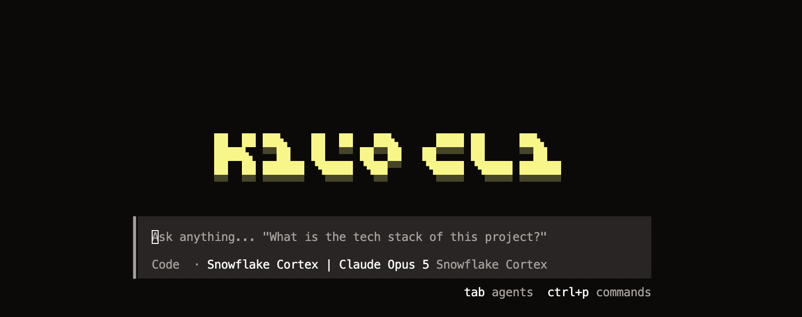
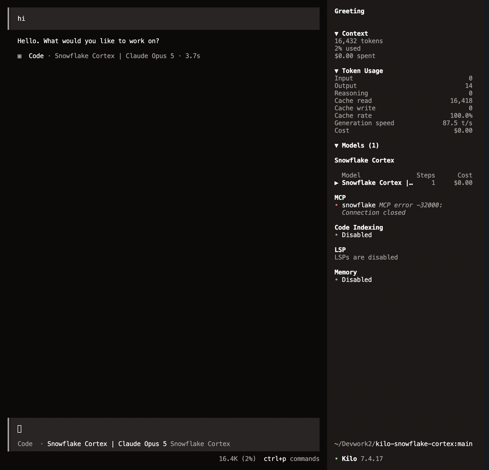
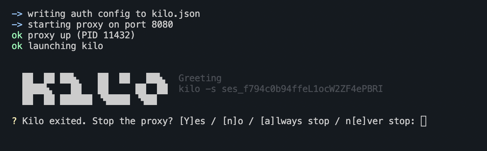

# Kilo x Snowflake Cortex

Use [Kilo Code](https://kilocode.ai) with **Snowflake Cortex** models -- Claude Opus 5, Sonnet 5, GPT 5.4 -- with full agentic tool calling. Your code and prompts stay inside your Snowflake perimeter. No third-party model API keys required.

<p align="center">
  
</p>
<p align="center">
  
</p>
<p align="center">
  
</p>

## Why

Connecting Kilo to Snowflake Cortex today means manually wiring up authentication, figuring out which API endpoint and provider config to use, translating incompatible request parameters, and refreshing tokens before they expire. That's a lot of friction before you can write your first prompt.

**`ksc`** eliminates that friction:

- **One-liner install** -- downloads everything, installs Kilo if needed, configures all available Cortex models
- **Named auth profiles** -- store PAT, keypair, OAuth, or SSO device code credentials once, switch between accounts/roles with `ksc <profile>`
- **Automatic token lifecycle** -- mints, refreshes, and injects tokens so you never hit an expired-credential error mid-session
- **Zero-config proxy** -- transparently fixes `max_tokens` vs `max_completion_tokens` incompatibilities and handles streaming, so Kilo just works
- **Cross-platform** -- macOS, Linux, Windows

## How it works

Snowflake Cortex natively supports the **OpenAI Chat Completions API** at `/api/v2/cortex/v1/chat/completions`. The `ksc` launcher loads your auth profile, starts a lightweight local proxy that handles authentication and parameter translation, and launches Kilo -- all in one command:

```
ksc <profile>
    |  loads auth profile (PAT / keypair / OAuth / device code)
    |  starts proxy on 127.0.0.1:8080
    |  launches kilo
    v
Kilo  -->  proxy  -->  Snowflake Cortex
           fixes max_tokens,
           injects auth token
```

## Install

**macOS / Linux:**
```bash
curl -fsSL https://raw.githubusercontent.com/sfc-gh-kkeller/kilo-snowflake-cortex/main/install.sh | bash
```

**Windows (PowerShell):**
```powershell
irm https://raw.githubusercontent.com/sfc-gh-kkeller/kilo-snowflake-cortex/main/install.ps1 | iex
```

The installer:
1. Checks for Python 3.9+ (required)
2. Installs [Kilo Code CLI](https://kilocode.ai) if not already present
3. Downloads ksc and the auth proxy
4. Configures all available Cortex models in kilo.json
5. Prompts you to create your first auth profile

### Requirements

- Python 3.9+
- A Snowflake account with Cortex enabled
- A Snowflake **programmatic access token (PAT)**, keypair, or OAuth credentials
- `pip install PyJWT cryptography` (only for keypair or OAuth auth)

## Quick start

```bash
# Add your Snowflake credentials
ksc add myaccount

# Launch Kilo with Snowflake Cortex
ksc myaccount
```

## ksc CLI

```bash
ksc                              # launch with default profile
ksc <profile>                    # launch with named profile
ksc <profile> -- run -m "..."    # launch kilo CLI with args
ksc list                         # list profiles
ksc add <name>                   # add profile interactively
ksc remove <name>                # remove profile
ksc default <name>               # set default profile
ksc setup                        # write model catalog + MCP to kilo.json
ksc start <profile>              # start proxy only (no kilo)
ksc status                       # show proxy health
ksc stop                         # stop running proxy
ksc add-mcp <name>               # add MCP server connection
ksc remove-mcp <name>            # remove MCP server connection
ksc list-mcp                     # list MCP server connections
ksc version                      # show version
```

### Profile examples

Each profile stores a complete auth configuration:

**PAT** (simplest):
```bash
ksc add prod
# Account: MYORG-MYACCOUNT
# User: me@example.com
# Auth type: pat
# PAT: <hidden>
```

**Keypair JWT**:
```bash
ksc add dev-keypair
# Auth type: privatekey
# Private key path: ~/.snowflake/rsa_key.p8
```

**Snowflake OAuth** (browser-based):
```bash
ksc add staging-oauth
# Auth type: snowflake_oauth
# Client ID: from DESCRIBE INTEGRATION
# Client secret: <hidden>
```

**External OAuth device code**:
```bash
ksc add corp-sso
# Auth type: device_code
# Client ID: my-app-client-id
# Device auth endpoint: https://idp.example.com/device/authorize
# Token endpoint: https://idp.example.com/oauth/token
```

### Persisting refresh tokens

By default, refresh tokens are kept in memory only (most secure). To persist them across restarts:

```bash
ksc myprofile --persist-refresh-token
```

### Environment variables

| Variable | Default | Description |
|---|---|---|
| `KSC_PORT` | `8080` | Proxy listen port |
| `KSC_INSTALL_DIR` | `~/.local/share/kilo-snowflake-cortex` | Install directory (macOS/Linux) |
| `KSC_BIN_DIR` | `~/.local/bin` | Binary directory (macOS/Linux) |

## Authentication

Set `auth.type` in the profile:

| Type | Fields | Notes |
|---|---|---|
| `pat` | `auth.pat` | Static token. Simplest option |
| `privatekey` | `auth.private_key_path` | Keypair JWT. Re-minted every 55 min. Requires `cryptography` + `PyJWT` |
| `snowflake_oauth` | `auth.client_id`, `auth.client_secret` | Authorization code + PKCE. Opens browser |
| `device_code` | `auth.client_id`, `auth.device_authorization_endpoint`, `auth.token_endpoint`, `auth.scope` | External OAuth. Displays code for browser |

### Auth sidecar (standalone)

The proxy/sidecar can also be used directly without `ksc`:

```bash
python3 proxy/snowflake-auth-sidecar.py --proxy     # proxy mode (recommended)
python3 proxy/snowflake-auth-sidecar.py --once       # authenticate once and exit
python3 proxy/snowflake-auth-sidecar.py --status     # show auth state
python3 proxy/snowflake-auth-sidecar.py --verify     # verify current token
```

## Models

Available models (depends on account/region):

| Model | Context | Max output |
|---|---:|---:|
| `claude-opus-5` | 1,000,000 | 128,000 |
| `claude-opus-4-8` / `4-7` / `4-6` | 1,000,000 | 128,000 |
| `claude-sonnet-5` / `4-6` | 1,000,000 | 64,000 |
| `claude-opus-4-5` / `sonnet-4-5` / `haiku-4-5` | 200,000 | 64,000 |
| `openai-gpt-5.4` | 400,000 | 128,000 |
| `openai-gpt-5.2` | 272,000 | 8,192 |

## Querying Snowflake data via MCP

The auth proxy handles both **inference credentials** and **MCP data access**. Configure Snowflake managed MCP servers with `ksc add-mcp` and the proxy will inject auth tokens automatically.

### Managed MCP server (recommended)

The proxy authenticates and forwards JSON-RPC requests to the Snowflake-managed MCP server:

```bash
# Add a managed MCP server connection
ksc add-mcp my-data
#  Type: managed
#  Auth profile: pat1
#  URL: https://ACCT.snowflakecomputing.com/api/v2/databases/DB/schemas/SCH/mcp-servers/MY_MCP

# Update kilo.json with the MCP entry
ksc setup
```

After `ksc setup`, Kilo sees the MCP server at `http://127.0.0.1:8080/mcp/my-data` and calls it transparently. Each MCP server can use a different auth profile (different account, role, or auth type).

```
Kilo  -->  proxy /mcp/my-data  -->  Snowflake managed MCP server
           injects Bearer token       (tools/list, tools/call)
           from "pat1" profile
```

### Community MCP server

For the community `snowflake-labs-mcp` (stdio transport), ksc populates CLI args from the profile:

```bash
ksc add-mcp local-data
#  Type: community
#  Auth profile: pat1
#  Service config: ~/.config/kilo/mcp-services.yaml

ksc setup   # writes command array into kilo.json
```

### MCP CLI commands

```bash
ksc add-mcp <name>       # add MCP server connection
ksc remove-mcp <name>    # remove MCP server connection
ksc list-mcp             # list configured MCP servers
```

## Translating proxy (advanced)

For server-side Cortex Agent tools (Cortex Search, Cortex Analyst, SQL execution), the translating proxy translates between Kilo's OpenAI Responses API and Snowflake's Cortex Agent API:

```bash
python3 proxy/snowflake-cortex-proxy.py
```

This is only needed if you want Snowflake to orchestrate tools server-side. For most use cases, the native OpenAI API with client-side MCP is sufficient.

## Disclaimer

This is a personal project by [Kevin Keller](https://github.com/sfc-gh-kkeller). It is **not** an official Snowflake product and is not supported, endorsed, or guaranteed by Snowflake in any way. Use at your own risk.

This code is intended as **inspiration** to help reduce friction between Kilo Code and Snowflake Cortex. It is not intended for production use without your own security review, hardening, and penetration testing. Treat it as a starting point for building your own solution.

Licensed under the [MIT License](LICENSE).

## Layout

```
proxy/ksc.py                    ksc launcher (profiles + proxy + kilo)
proxy/snowflake-auth-sidecar.py auth token manager and lightweight proxy
proxy/snowflake-cortex-proxy.py translating proxy for Cortex Agent API (advanced)
test/idp.py                     throwaway OIDC IdP for testing device code flow
install.sh                      one-liner installer (macOS/Linux)
install.ps1                     one-liner installer (Windows)
install-ksc.sh                  manual symlink helper
run.sh / run.bat                legacy launch scripts
setup.sh / setup.bat            legacy setup scripts
LICENSE                         MIT
```
